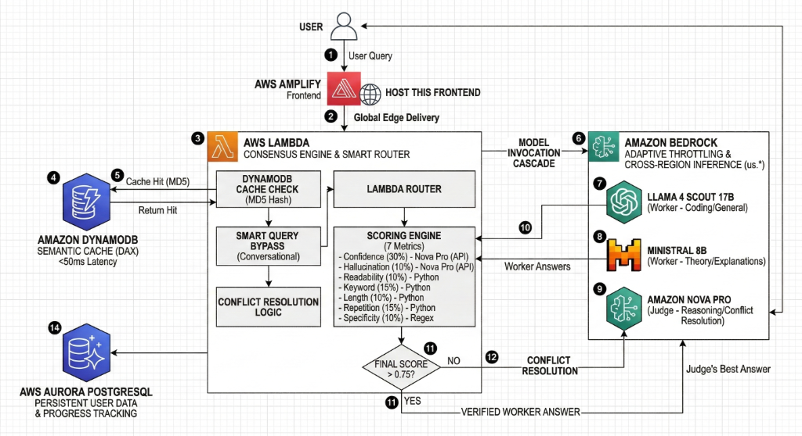

# Consensus Bedrock Engine

A **production-grade, multi-agent AI consensus system** built on AWS. It routes user queries to specialist worker LLMs, scores their answers across 7 quantitative metrics, and invokes a powerful Judge model only when needed — combining the speed of small models with the accuracy of frontier AI.

---

## Architecture Overview



---

## Models

| Role | Model | Provider | Why |
|---|---|---|---|
| **Worker 1** | Llama 4 Scout 17B | Meta | Ultra-fast, excellent at coding & general queries |
| **Worker 2** | Ministral 8B | Mistral AI | High diversity, excellent at explanations & theory |
| **Judge** | Amazon Nova Pro | Amazon | Frontier-level reasoning, zero marketplace friction, 4× cheaper than Claude |

---

## 7-Metric Scoring Engine

Each worker answer is automatically scored across 7 dimensions before the Judge is invoked:

| # | Metric | Weight | How It Works |
|---|---|---|---|
| a | **Confidence Score** | 30% | Nova Pro reads the Q&A and rates confidence from 0–1 |
| b | **Keyword Match Score** | 15% | Checks if the answer contains key terms from the query |
| c | **Length Score** | 10% | Ensures the answer is long enough for the complexity of the question |
| d | **Repetition Penalty** | 15% | Penalizes responses that pad with repeated words (unique word ratio) |
| e | **Readability Score** | 10% | Flesch-Kincaid formula — rewards clear, well-structured prose |
| f | **Specificity Score** | 10% | Rewards answers with numbers, proper nouns, and named entities |
| g | **Hallucination Defense** | 10% | Nova Pro rates factual accuracy of the worker's answer (0 = hallucinated) |

> **Final Score** = weighted average of all 7 metrics. Score > 0.75 → VERIFIED. Score ≤ 0.75 → Judge invoked.

---

## AWS Bedrock Best-Practice Implementations

### Adaptive Throttling (HTTP 429 Prevention)
```python
retry_config = Config(retries={'max_attempts': 5, 'mode': 'adaptive'})
bedrock_client = boto3.client('bedrock-runtime', config=retry_config)
```
Automatically backs off and retries on AWS rate-limit errors. Zero crashes, zero manual handling.

### Cross-Region Inference (High Availability)
All models use `us.` prefixed inference profile IDs:
```
us.meta.llama4-scout-17b-instruct-v1:0
us.amazon.nova-pro-v1:0
```
If `us-east-1` is overloaded, AWS silently re-routes to `us-west-2`. Your users never notice.

### LLM Cascade & Router Pattern (Cost Optimization)
Expensive frontier models are only invoked when the worker's score drops below a threshold. Average query cost: **< $0.000006**.

### DynamoDB Semantic Cache (Latency & Cost Elimination)
Identical queries are hashed (MD5) and served from DynamoDB in **< 50ms** with zero Bedrock API calls.

### Smart Query Bypass (Conversational Intelligence)
Hundreds of conversational triggers are detected to bypass strict keyword/length penalties for small-talk, greetings, and simple utility queries — ensuring a natural user experience.

---

## Deployment

### Prerequisites
- AWS CLI configured (`aws configure`)
- Node.js (for CDK CLI)
- Python 3.9+

### Setup

```powershell
# 1. Clone and enter the project
cd consensus_bedrock

# 2. Create and activate virtual environment (Windows)
python -m venv .venv
.venv\Scripts\activate.bat

# 3. Install Python dependencies
pip install -r requirements.txt

# 4. Install CDK CLI
npm install -g aws-cdk

# 5. Bootstrap your AWS account (first time only)
cdk bootstrap

# 6. Deploy
cdk deploy
```

### AWS Amplify (Frontend)
The frontend is deployed via **AWS Amplify** for global edge delivery:
- **URL**: [https://prototype.d3ddhsf8bhejkw.amplifyapp.com/](https://prototype.d3ddhsf8bhejkw.amplifyapp.com/)
- **CI/CD**: Auto-deploys on every push to the `main` branch.

### AWS Lambda URL (Backend)
The terminal will print your regional endpoint after `cdk deploy`:
```
ConsensusBedrockStack.ConsensusAPIEndpoint = https://6u6a3ub4qmn4qppzc7hdsnflqy0lkold.lambda-url.us-east-1.on.aws/
```

---

## Using the Frontend

1. Open `frontend/index.html` in your browser
2. Paste your Lambda URL into the **AWS Lambda URL** field
3. Type a query and click **Validate**

### Example Queries

| Query Type | Example | Expected Result |
|---|---|---|
| Conversational | `hi` | VERIFIED — Llama answers instantly, Judge skipped |
| Coding | `write a python function to sort a list` | VERIFIED — Llama handles it cleanly |
| Theory | `explain how photosynthesis works` | VERIFIED — Ministral explains, Judge scores it high |
| Complex Logic | `A farmer has a wolf, a goat, and a cabbage...` | **CONFLICT RESOLVED** — Judge fixes Llama's hallucination |

---

## Project Structure

```
consensus_bedrock/
│
├── app.py                          # CDK App entry point
├── requirements.txt                # Python dependencies
│
├── consensus_bedrock_backend/
│   └── consensus_bedrock_stack.py  # CDK Stack: Lambda + IAM + Function URL
│
├── lambda/
│   └── lambda_function.py          # Core AI logic: Agents, Router, Scoring, Judge
│
└── frontend-app/
    ├── index.html                  # Vite Entry Point
    └── src/                        # React Source (Pages, Components)
```

---

## Useful CDK Commands

| Command | Description |
|---|---|
| `cdk deploy` | Deploy stack to AWS |
| `cdk destroy` | Delete all AWS resources |
| `cdk diff` | Preview changes before deploying |
| `cdk synth` | Emit the CloudFormation template |
| `cdk ls` | List all stacks |

---

## Cost Estimate

Running 1,000 queries per day:

| Resource | Estimated Cost |
|---|---|
| Lambda Invocations | ~$0.00 (free tier) |
| Llama 4 Scout (Worker) | ~$0.01/day |
| Ministral 8B (Worker) | ~$0.01/day |
| Amazon Nova Pro (Judge, ~30% invocation rate) | ~$0.04/day |
| DynamoDB Cache reads | ~$0.00 (free tier) |
| **Total** | **~$0.06/day** |

> Costs are approximate. Use [AWS Pricing Calculator](https://calculator.aws) for exact estimates.
