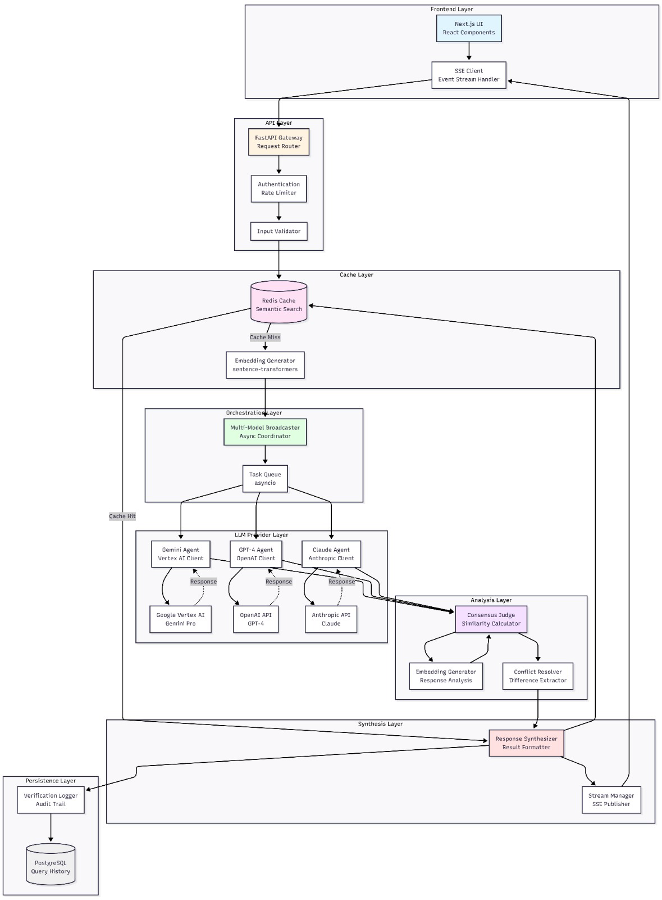
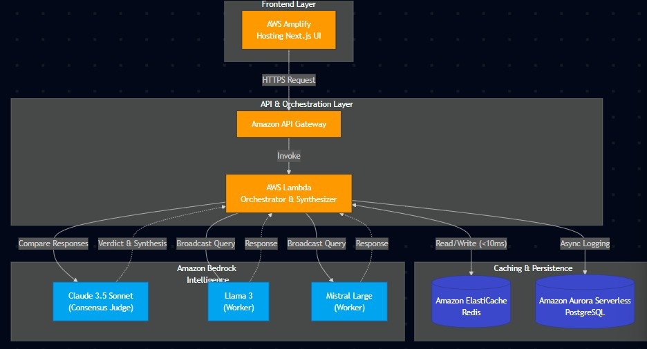
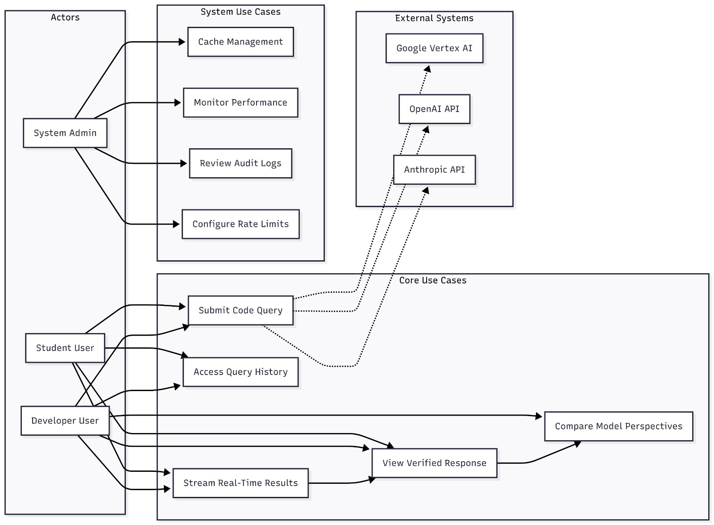

# Design Document: Consensus

## Overview

Consensus implements a pipelined architecture inspired by Aptos Block-STM to process AI queries through parallel execution and consensus validation. The system broadcasts queries to multiple LLM providers simultaneously, executes them optimistically in parallel, validates responses through a consensus judge, and commits the synthesized result. This approach minimizes latency while maximizing verification confidence through multi-model agreement.

The architecture consists of four primary stages:
1. **Dissemination**: Broadcast queries to multiple LLM providers
2. **Optimistic Execution**: Generate responses in parallel without blocking
3. **Validation**: Compare and evaluate responses for consensus
4. **Commit**: Synthesize and deliver the final verified result

## Architecture

### System Architecture Diagram



The architecture diagram shows the complete AWS-based system structure:
- Frontend Layer: Next.js UI hosted on AWS Amplify with CI/CD and automatic scaling
- API Layer: Amazon API Gateway for traffic management and AWS Lambda for serverless compute
- Cache Layer: Amazon ElastiCache (Redis) with <10ms response time for semantic search
- Orchestration Layer: Multi-model broadcaster with async coordination
- AI Layer: Amazon Bedrock providing unified access to Claude 3.5 Sonnet (Judge), Llama 3, and Mistral Large (Workers)
- Analysis Layer: Consensus judge and conflict resolver
- Synthesis Layer: Response synthesizer and stream manager
- Persistence Layer: Aurora Serverless (PostgreSQL) with auto-scaling and CloudWatch logging

### Process Flow Diagram



The sequence diagram illustrates the complete request flow through AWS services:
1. User submits query through Next.js frontend hosted on AWS Amplify
2. Amazon API Gateway routes request to AWS Lambda (FastAPI)
3. Lambda checks ElastiCache (Redis) for semantic cache hit (<10ms response)
4. On cache miss, broadcaster sends query to multiple models via Amazon Bedrock in parallel
5. Claude 3.5 Sonnet (Judge), Llama 3, and Mistral Large process queries concurrently
6. Responses stream back in real-time through Lambda to the frontend
7. Consensus judge compares responses and calculates similarity score
8. For low consensus, conflict resolver extracts different perspectives
9. Final result is cached in ElastiCache and logged to Aurora Serverless
10. Frontend displays verification status and consensus score

### Use Case Diagram



The use case diagram shows three actor types and their interactions:
- Student Users: Submit queries, view verified responses, access history, stream real-time results
- Developer Users: All student capabilities plus comparing model perspectives
- System Admins: Manage cache, monitor performance, review audit logs, configure rate limits

External systems include Amazon Bedrock providing unified access to Claude 3.5 Sonnet (Judge Agent), Meta Llama 3, and Mistral Large (Worker Models) for multi-model verification.

### Pipelined Architecture Stages

#### Stage 1: Dissemination (Broadcast)
The API Gateway receives user queries and checks the Semantic Cache. On cache miss, the Multi-Model Broadcaster disseminates the query to all configured LLM providers simultaneously. This stage uses asynchronous I/O to initiate multiple requests without blocking.

#### Stage 2: Optimistic Execution (Parallel Generation)
Each LLM agent executes independently and optimistically, generating responses without waiting for other agents. Responses stream back as they complete, allowing early display to users. This stage leverages Python's asyncio for concurrent execution.

#### Stage 3: Validation (Judge Comparison)
The Consensus Judge collects all responses and performs semantic comparison using embedding similarity and structural analysis. It calculates a Consensus Score and identifies areas of agreement or conflict. The Conflict Resolver processes disagreements and prepares nuanced views.

#### Stage 4: Commit (Synthesis)
The Response Synthesizer commits the final result by combining consensus information, verification status, and conflict details. Results are persisted to PostgreSQL for history tracking and cached in Redis for future queries.

## Components and Interfaces

### Frontend Components (Next.js)

#### QueryInterface Component
```typescript
interface QueryInterfaceProps {
  onSubmit: (query: string) => void;
  isLoading: boolean;
}

// Handles user input and query submission
// Provides real-time validation and character limits
```

#### ResponseDisplay Component
```typescript
interface ResponseDisplayProps {
  responses: ModelResponse[];
  consensusScore: number;
  verificationStatus: VerificationStatus;
  conflicts?: ConflictView[];
}

// Displays streaming responses from multiple models
// Shows verification badges and consensus indicators
// Renders conflict resolution UI when needed
```

#### StreamingHandler
```typescript
interface StreamingHandler {
  connect(queryId: string): EventSource;
  onMessage(callback: (data: StreamData) => void): void;
  onError(callback: (error: Error) => void): void;
  close(): void;
}

// Manages Server-Sent Events connection
// Handles real-time response streaming
```

### Backend Components (FastAPI)

#### API Gateway
```python
class APIGateway:
    def __init__(self, cache: SemanticCache, broadcaster: MultiModelBroadcaster):
        self.cache = cache
        self.broadcaster = broadcaster
    
    async def handle_query(self, query: QueryRequest) -> QueryResponse:
        """
        Entry point for all queries
        Checks cache, initiates broadcast on miss
        Returns streaming response
        """
        pass
    
    async def get_history(self, user_id: str, limit: int) -> List[HistoryEntry]:
        """
        Retrieves user query history from database
        """
        pass
```

#### MultiModelBroadcaster
```python
class MultiModelBroadcaster:
    def __init__(self, agents: List[LLMAgent]):
        self.agents = agents
    
    async def broadcast(self, query: str) -> AsyncIterator[ModelResponse]:
        """
        Sends query to all LLM agents concurrently
        Yields responses as they arrive
        Handles timeouts and failures gracefully
        """
        pass
```

#### LLMAgent (Abstract Base)
```python
class LLMAgent(ABC):
    @abstractmethod
    async def generate(self, query: str) -> ModelResponse:
        """
        Generates response from specific LLM provider via Amazon Bedrock
        Implements retry logic and error handling
        """
        pass

class ClaudeJudgeAgent(LLMAgent):
    """Implementation for Anthropic Claude 3.5 Sonnet via Bedrock - Judge Agent"""
    pass

class LlamaAgent(LLMAgent):
    """Implementation for Meta Llama 3 via Bedrock - Worker Model"""
    pass

class MistralAgent(LLMAgent):
    """Implementation for Mistral Large via Bedrock - Worker Model"""
    pass
```

#### ConsensusJudge
```python
class ConsensusJudge:
    def __init__(self, embedding_model: EmbeddingModel):
        self.embedding_model = embedding_model
    
    async def evaluate(self, responses: List[ModelResponse]) -> ConsensusResult:
        """
        Compares responses using semantic similarity
        Calculates consensus score (0.0 to 1.0)
        Identifies agreement and conflict areas
        """
        pass
    
    def calculate_similarity(self, resp1: str, resp2: str) -> float:
        """
        Computes cosine similarity between response embeddings
        """
        pass
```

#### ConflictResolver
```python
class ConflictResolver:
    def resolve(self, consensus_result: ConsensusResult) -> ConflictView:
        """
        Processes low-consensus results
        Extracts unique perspectives from each model
        Structures conflicts for user presentation
        """
        pass
    
    def extract_differences(self, responses: List[ModelResponse]) -> List[Difference]:
        """
        Identifies specific points of disagreement
        """
        pass
```

#### SemanticCache
```python
class SemanticCache:
    def __init__(self, redis_client: Redis, embedding_model: EmbeddingModel):
        self.redis = redis_client
        self.embedding_model = embedding_model
    
    async def get(self, query: str, threshold: float = 0.9) -> Optional[CachedResult]:
        """
        Searches for semantically similar cached queries
        Returns cached result if similarity exceeds threshold
        """
        pass
    
    async def set(self, query: str, result: QueryResponse, ttl: int = 86400) -> None:
        """
        Stores query and result with semantic embedding
        Sets expiration time (default 24 hours)
        """
        pass
```

## Data Models

### Core Data Structures

#### QueryRequest
```python
class QueryRequest(BaseModel):
    query: str
    user_id: Optional[str] = None
    context: Optional[Dict[str, Any]] = None
    max_models: int = 3
```

#### ModelResponse
```python
class ModelResponse(BaseModel):
    model_name: str
    provider: str
    content: str
    timestamp: datetime
    latency_ms: int
    metadata: Dict[str, Any]
```

#### ConsensusResult
```python
class ConsensusResult(BaseModel):
    consensus_score: float
    verification_status: VerificationStatus
    agreements: List[str]
    conflicts: List[Conflict]
    responses: List[ModelResponse]
```

#### ConflictView
```python
class Conflict(BaseModel):
    area: str
    perspectives: List[Perspective]

class Perspective(BaseModel):
    model_name: str
    viewpoint: str
    reasoning: Optional[str]

class ConflictView(BaseModel):
    has_conflicts: bool
    conflicts: List[Conflict]
```

#### VerificationStatus
```python
class VerificationStatus(str, Enum):
    VERIFIED = "verified"  # consensus_score >= 0.7
    PARTIAL = "partial"    # 0.4 <= consensus_score < 0.7
    CONFLICTED = "conflicted"  # consensus_score < 0.4
    SINGLE_SOURCE = "single_source"  # only one model responded
```

### Database Schema

#### Users Table
```sql
CREATE TABLE users (
    id UUID PRIMARY KEY DEFAULT gen_random_uuid(),
    email VARCHAR(255) UNIQUE,
    created_at TIMESTAMP DEFAULT CURRENT_TIMESTAMP,
    last_active TIMESTAMP
);

CREATE INDEX idx_users_email ON users(email);
```

#### Queries Table
```sql
CREATE TABLE queries (
    id UUID PRIMARY KEY DEFAULT gen_random_uuid(),
    user_id UUID REFERENCES users(id),
    query_hash VARCHAR(64) NOT NULL,  -- SHA-256 hash for privacy
    query_embedding VECTOR(768),      -- For semantic search
    consensus_score FLOAT,
    verification_status VARCHAR(20),
    created_at TIMESTAMP DEFAULT CURRENT_TIMESTAMP
);

CREATE INDEX idx_queries_user_id ON queries(user_id);
CREATE INDEX idx_queries_created_at ON queries(created_at DESC);
CREATE INDEX idx_queries_embedding ON queries USING ivfflat (query_embedding vector_cosine_ops);
```

#### VerificationLogs Table
```sql
CREATE TABLE verification_logs (
    id UUID PRIMARY KEY DEFAULT gen_random_uuid(),
    query_id UUID REFERENCES queries(id),
    model_name VARCHAR(50),
    provider VARCHAR(50),
    response_hash VARCHAR(64),  -- SHA-256 hash of response
    latency_ms INTEGER,
    success BOOLEAN,
    error_message TEXT,
    created_at TIMESTAMP DEFAULT CURRENT_TIMESTAMP
);

CREATE INDEX idx_verification_logs_query_id ON verification_logs(query_id);
CREATE INDEX idx_verification_logs_model ON verification_logs(model_name);
```

## Tech Stack

### Frontend
- **Framework**: Next.js 14 (App Router)
- **Language**: TypeScript
- **Styling**: Tailwind CSS
- **State Management**: React Context + Hooks
- **HTTP Client**: Fetch API with Server-Sent Events
- **Hosting**: AWS Amplify (CI/CD, automatic scaling, CDN)

### Backend
- **Framework**: FastAPI 0.104+
- **Language**: Python 3.11+
- **Async Runtime**: asyncio
- **API Documentation**: OpenAPI (Swagger) auto-generated
- **Compute**: AWS Lambda (Serverless, scales to zero)
- **API Gateway**: Amazon API Gateway (traffic management, rate limiting, routing)

### Data Layer
- **Cache**: Amazon ElastiCache (Redis) - Semantic cache with <10ms response time
- **Database**: Amazon Aurora Serverless (PostgreSQL) - Auto-scaling capacity
- **ORM**: SQLAlchemy 2.0 (async)

### AI/ML Services (Consensus Engine)
- **Unified API**: Amazon Bedrock - Single interface for multiple foundation models
- **Judge Agent**: Anthropic Claude 3.5 Sonnet (via Bedrock) - High reasoning capability for arbitration
- **Worker Models**: 
  - Meta Llama 3 (via Bedrock) - Diverse perspective #1
  - Mistral Large (via Bedrock) - Diverse perspective #2
- **Embeddings**: Amazon Bedrock Embeddings or sentence-transformers for semantic similarity

### Infrastructure
- **Infrastructure as Code**: AWS CloudFormation - Reproducible and scalable architecture
- **Monitoring**: AWS CloudWatch (logs, metrics, alarms)
- **Security**: AWS IAM, AWS Secrets Manager

## API Endpoints

### POST /api/v1/ask
Submit a query for multi-model verification.

**Request:**
```json
{
  "query": "How do I implement a binary search tree in Python?",
  "user_id": "optional-user-id",
  "context": {},
  "max_models": 3
}
```

**Response (Streaming):**
```
event: model_response
data: {"model": "gemini", "content": "...", "timestamp": "..."}

event: model_response
data: {"model": "gpt4", "content": "...", "timestamp": "..."}

event: consensus
data: {"score": 0.85, "status": "verified", "conflicts": []}

event: complete
data: {"query_id": "uuid", "total_latency_ms": 2500}
```

**Response (Non-Streaming):**
```json
{
  "query_id": "uuid",
  "consensus_score": 0.85,
  "verification_status": "verified",
  "responses": [
    {
      "model_name": "gemini-pro",
      "provider": "google",
      "content": "...",
      "latency_ms": 1200
    }
  ],
  "conflicts": [],
  "cached": false
}
```

### GET /api/v1/history
Retrieve user query history.

**Query Parameters:**
- `user_id` (required): User identifier
- `limit` (optional, default=20): Number of results
- `offset` (optional, default=0): Pagination offset

**Response:**
```json
{
  "total": 45,
  "limit": 20,
  "offset": 0,
  "results": [
    {
      "query_id": "uuid",
      "query_hash": "sha256...",
      "consensus_score": 0.85,
      "verification_status": "verified",
      "created_at": "2024-01-15T10:30:00Z"
    }
  ]
}
```


## Correctness Properties

*A property is a characteristic or behavior that should hold true across all valid executions of a system—essentially, a formal statement about what the system should do. Properties serve as the bridge between human-readable specifications and machine-verifiable correctness guarantees.*

### Property Reflection

After analyzing all acceptance criteria, I identified several areas where properties can be consolidated:

- Properties 1.1 and 1.4 both relate to the broadcaster's collection behavior and can be combined into a single property about complete concurrent broadcasting
- Properties 2.2 and 2.3 test opposite sides of the same scoring logic and can be unified into one property about score-consensus correlation
- Properties 3.2, 3.3, and 3.4 all relate to conflict output structure and can be combined into a comprehensive conflict presentation property
- Properties 4.1 and 4.2 both test cache lookup behavior and can be unified
- Properties 5.1 and 5.2 both relate to streaming response metadata and can be combined
- Properties 9.1 and 9.2 both test graceful degradation and can be unified into one resilience property
- Properties 10.2, 10.3, and 10.4 all relate to data privacy and can be consolidated

### Broadcasting Properties

**Property 1: Concurrent Multi-Model Broadcasting**
*For any* query, the Multi_Model_Broadcaster should send the query to at least two LLM providers concurrently via Amazon Bedrock (including Claude Judge and worker models like Llama 3 and Mistral Large), and collect all successful responses for comparison.
**Validates: Requirements 1.1, 1.2, 1.4**

**Property 2: Resilient Broadcasting**
*For any* query where one or more LLM providers fail, the Multi_Model_Broadcaster should continue processing and return results from all successful providers without blocking on failures.
**Validates: Requirements 1.3, 9.1**

### Consensus and Verification Properties

**Property 3: Consensus Score Correlation**
*For any* pair of responses, if the responses have high semantic similarity (>0.8 embedding cosine similarity), the Consensus_Score should be above 0.7, and if they have low semantic similarity (<0.5), the Consensus_Score should be below 0.7.
**Validates: Requirements 2.2, 2.3**

**Property 4: Verification Status Assignment**
*For any* consensus result, the Judge_Agent should assign a valid Verification_Status (VERIFIED, PARTIAL, CONFLICTED, or SINGLE_SOURCE) based on the consensus score and number of responses.
**Validates: Requirements 2.4**

**Property 5: Semantic Comparison Completeness**
*For any* set of N model responses, the Judge_Agent should perform semantic comparison on all N responses (not just pairwise), considering the overall agreement across all models.
**Validates: Requirements 2.1**

**Property 6: Single Source Degradation**
*For any* query where only one LLM provider successfully responds, the system should return that response with Verification_Status set to SINGLE_SOURCE.
**Validates: Requirements 9.2**

### Conflict Resolution Properties

**Property 7: Conflict Identification and Presentation**
*For any* consensus result with score below 0.7, the Conflict_Resolver should identify specific areas of disagreement, extract each unique perspective with its source LLM provider label, and structure them in the ConflictView format.
**Validates: Requirements 3.1, 3.2, 3.3, 3.4**

### Caching Properties

**Property 8: Semantic Cache Lookup**
*For any* query, the Semantic_Cache should check for semantically similar previous queries using embedding similarity, and return cached results when similarity exceeds the threshold (default 0.9).
**Validates: Requirements 4.1, 4.2**

**Property 9: Cache Storage Round-Trip**
*For any* query and its consensus result, storing them in the Semantic_Cache and then retrieving with the same query should return an equivalent result.
**Validates: Requirements 4.3**

### Streaming Properties

**Property 10: Immediate Response Streaming with Metadata**
*For any* LLM provider response, the Backend_API should stream the response immediately upon receipt, and each streamed response should include the provider identifier and model name.
**Validates: Requirements 5.1, 5.2**

**Property 11: Consensus Completion Event**
*For any* query where all responses have been streamed, the Backend_API should send a final event containing the Consensus_Score and Verification_Status.
**Validates: Requirements 5.4**

### Input Validation Properties

**Property 12: Query Parameter Validation**
*For any* request to the Backend_API, invalid query parameters (empty query, negative max_models, etc.) should be rejected with a 400 status code and descriptive error message, while valid parameters should be accepted.
**Validates: Requirements 6.2, 6.4**

### Error Handling Properties

**Property 13: Retry Logic**
*For any* network error when calling an LLM provider, the system should retry the request up to 2 times before marking it as failed.
**Validates: Requirements 9.4**

**Property 14: Error Logging Completeness**
*For any* error that occurs, the system should log an entry containing at minimum: timestamp, error type, error message, and relevant context (query_id, model_name, etc.).
**Validates: Requirements 9.5**

### Security and Privacy Properties

**Property 15: Data Privacy in Storage**
*For any* query stored in cache or database, the stored representation should not contain personally identifiable information patterns (email addresses, phone numbers, API keys, etc.), and queries should be hashed or sanitized.
**Validates: Requirements 10.2, 10.3, 10.4**

**Property 16: Rate Limiting**
*For any* user or IP address, if they exceed the rate limit threshold (e.g., 100 requests per minute), subsequent requests should be rejected with a 429 status code until the rate limit window resets.
**Validates: Requirements 10.5**

### UI Properties

**Property 17: Verification Status Display**
*For any* query result received by the Frontend_Client, the rendered output should include the Verification_Status value in a visible element.
**Validates: Requirements 7.3**

**Property 18: Loading State Indicators**
*For any* active streaming connection, the Frontend_Client should set and display loading state indicators, and clear them when streaming completes or errors.
**Validates: Requirements 7.5**

## Error Handling

### Error Categories

#### LLM Provider Errors
- **Timeout**: Provider fails to respond within configured timeout (default 10s)
- **API Error**: Provider returns error response (rate limit, invalid request, service unavailable)
- **Network Error**: Connection failure or network interruption

**Handling Strategy:**
- Log error with full context (provider, query_id, error details)
- Retry up to 2 times with exponential backoff (1s, 2s)
- Continue processing with other providers
- If all providers fail, return 503 Service Unavailable with error details

#### Cache Errors
- **Redis Connection Error**: Cannot connect to Redis instance
- **Cache Miss**: No semantically similar query found

**Handling Strategy:**
- On connection error: Log warning, bypass cache, proceed with LLM queries
- On cache miss: Normal flow, proceed with LLM queries
- Never block user requests due to cache failures

#### Validation Errors
- **Invalid Query**: Empty query, query exceeds max length
- **Invalid Parameters**: Negative values, unsupported options

**Handling Strategy:**
- Return 400 Bad Request immediately
- Include specific validation error message
- Do not process invalid requests

#### Database Errors
- **Connection Error**: Cannot connect to PostgreSQL
- **Write Error**: Failed to persist query history

**Handling Strategy:**
- Log error with full context
- Continue processing user request (history is non-critical)
- Return successful response to user even if history write fails
- Implement retry queue for failed writes

### Error Response Format

```json
{
  "error": {
    "code": "LLM_PROVIDER_FAILURE",
    "message": "All LLM providers failed to respond",
    "details": {
      "gemini": "Timeout after 10s",
      "gpt4": "Rate limit exceeded"
    },
    "query_id": "uuid",
    "timestamp": "2024-01-15T10:30:00Z"
  }
}
```

## Testing Strategy

### Dual Testing Approach

Consensus requires both unit testing and property-based testing for comprehensive coverage:

- **Unit Tests**: Verify specific examples, edge cases, and integration points
- **Property Tests**: Verify universal properties across randomized inputs

Together, these approaches ensure both concrete correctness (unit tests catch specific bugs) and general correctness (property tests verify behavior across all inputs).

### Property-Based Testing Configuration

**Library Selection:**
- **Python Backend**: Use `hypothesis` library for property-based testing
- **TypeScript Frontend**: Use `fast-check` library for property-based testing

**Test Configuration:**
- Each property test MUST run minimum 100 iterations
- Each test MUST include a comment tag referencing the design property
- Tag format: `# Feature: consensus, Property {number}: {property_text}`

**Example Property Test (Python):**
```python
from hypothesis import given, strategies as st

# Feature: consensus, Property 3: Consensus Score Correlation
@given(
    response1=st.text(min_size=50),
    response2=st.text(min_size=50)
)
def test_consensus_score_correlation(response1, response2):
    """
    For any pair of responses, consensus score should correlate
    with semantic similarity
    """
    judge = ConsensusJudge()
    similarity = judge.calculate_similarity(response1, response2)
    result = judge.evaluate([
        ModelResponse(content=response1, model_name="model1"),
        ModelResponse(content=response2, model_name="model2")
    ])
    
    if similarity > 0.8:
        assert result.consensus_score > 0.7
    elif similarity < 0.5:
        assert result.consensus_score < 0.7
```

### Unit Testing Focus Areas

Unit tests should focus on:

1. **Specific Examples**: Test known query-response pairs
2. **Edge Cases**: Empty responses, single-word queries, very long responses
3. **Integration Points**: API endpoint contracts, database schema validation
4. **Error Conditions**: Specific error scenarios (timeout, invalid JSON, etc.)

**Example Unit Test:**
```python
def test_empty_query_rejection():
    """Test that empty queries are rejected with 400 status"""
    response = client.post("/api/v1/ask", json={"query": ""})
    assert response.status_code == 400
    assert "query" in response.json()["error"]["message"].lower()
```

### Test Coverage Goals

- **Backend**: Minimum 80% code coverage
- **Critical Paths**: 100% coverage for consensus logic, caching, error handling
- **Property Tests**: All 18 correctness properties implemented
- **Integration Tests**: All API endpoints tested with realistic scenarios

### Testing Pyramid

```
    /\
   /  \     E2E Tests (5%)
  /____\    - Full user flows
 /      \   Integration Tests (15%)
/________\  - API contracts, DB operations
           Unit + Property Tests (80%)
           - Business logic, utilities
```